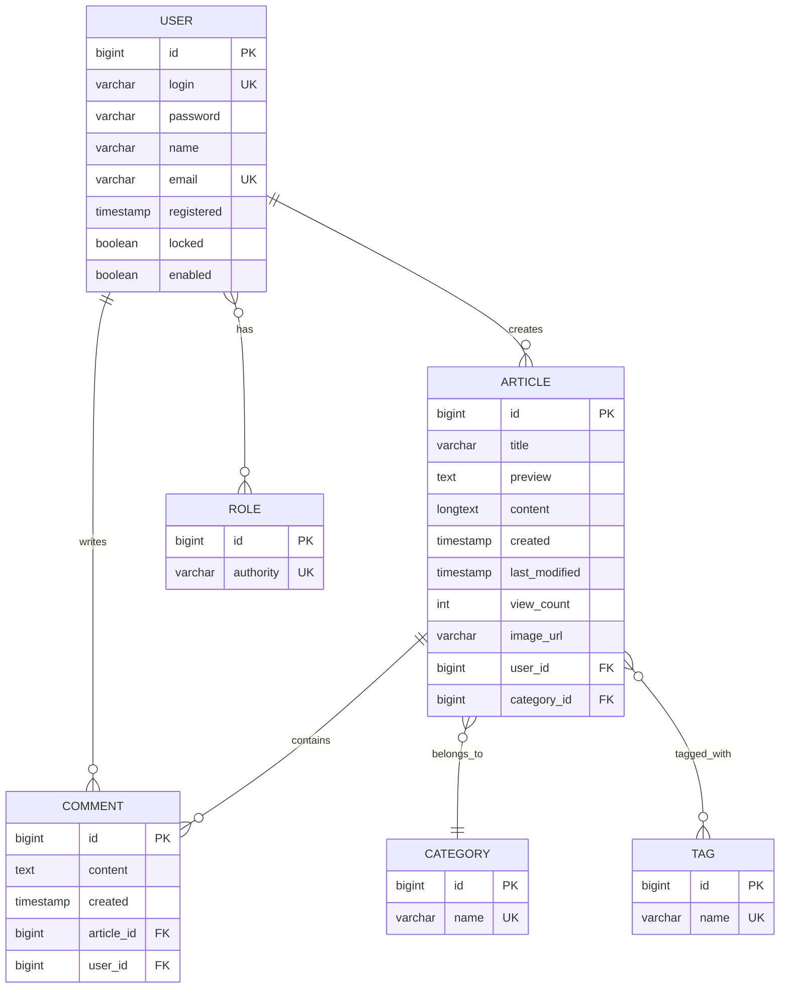

# Database Schema Documentation

Complete database schema and migration guide for newsportal-modern.

## Database Overview

**Supported Databases:**
- MySQL 8.0+ (Production)
- H2 (Development/Testing)

**Schema Management:** Hibernate Auto-DDL (`ddl-auto=update`)

## Entity Relationship Diagram



## Tables

### user

Stores user account information.

| Column | Type | Constraints | Description |
|--------|------|-------------|-------------|
| id | BIGINT | PK, AUTO_INCREMENT | Primary key |
| login | VARCHAR(30) | NOT NULL, UNIQUE | Username |
| password | VARCHAR(60) | NOT NULL | BCrypt hashed password |
| name | VARCHAR(50) | NOT NULL | Full name |
| email | VARCHAR(50) | NOT NULL, UNIQUE | Email address |
| registered | TIMESTAMP | DEFAULT CURRENT_TIMESTAMP | Registration date |
| locked | BOOLEAN | DEFAULT FALSE | Account locked status |
| enabled | BOOLEAN | DEFAULT TRUE | Account enabled status |

**Indexes:**
- PRIMARY KEY (`id`)
- UNIQUE KEY (`login`)
- UNIQUE KEY (`email`)

---

### role

Stores user roles for authorization.

| Column | Type | Constraints | Description |
|--------|------|-------------|-------------|
| id | BIGINT | PK, AUTO_INCREMENT | Primary key |
| authority | VARCHAR(20) | NOT NULL, UNIQUE | Role name (ROLE_USER, ROLE_AUTHOR, ROLE_ADMIN) |

**Indexes:**
- PRIMARY KEY (`id`)
- UNIQUE KEY (`authority`)

---

### user_role

Junction table for many-to-many relationship between users and roles.

| Column | Type | Constraints | Description |
|--------|------|-------------|-------------|
| user_id | BIGINT | FK → user.id | User reference |
| role_id | BIGINT | FK → role.id | Role reference |

**Indexes:**
- COMPOSITE PRIMARY KEY (`user_id`, `role_id`)
- FOREIGN KEY (`user_id`) REFERENCES `user` (`id`)
- FOREIGN KEY (`role_id`) REFERENCES `role` (`id`)

---

### article

Stores news articles.

| Column | Type | Constraints | Description |
|--------|------|-------------|-------------|
| id | BIGINT | PK, AUTO_INCREMENT | Primary key |
| title | VARCHAR(100) | NOT NULL | Article title |
| preview | VARCHAR(65535) | NOT NULL | Short preview |
| content | LONGTEXT | NOT NULL | Full HTML content |
| created | TIMESTAMP | DEFAULT CURRENT_TIMESTAMP | Creation date |
| last_modified | TIMESTAMP | NULL | Last modification date |
| view_count | INT | DEFAULT 0 | Number of views |
| image_url | VARCHAR(500) | NULL | Cover image path |
| user_id | BIGINT | FK → user.id, NOT NULL | Author reference |
| category_id | BIGINT | FK → category.id, NULL | Category reference |

**Indexes:**
- PRIMARY KEY (`id`)
- FOREIGN KEY (`user_id`) REFERENCES `user` (`id`)
- FOREIGN KEY (`category_id`) REFERENCES `category` (`id`)
- INDEX (`created`) - for sorting by date

---

### category

Stores article categories.

| Column | Type | Constraints | Description |
|--------|------|-------------|-------------|
| id | BIGINT | PK, AUTO_INCREMENT | Primary key |
| name | VARCHAR(30) | NOT NULL, UNIQUE | Category name |

**Indexes:**
- PRIMARY KEY (`id`)
- UNIQUE KEY (`name`)

---

### tag

Stores article tags.

| Column | Type | Constraints | Description |
|--------|------|-------------|-------------|
| id | BIGINT | PK, AUTO_INCREMENT | Primary key |
| name | VARCHAR(20) | NOT NULL, UNIQUE | Tag name |

**Indexes:**
- PRIMARY KEY (`id`)
- UNIQUE KEY (`name`)

---

### article_tag

Junction table for many-to-many relationship between articles and tags.

| Column | Type | Constraints | Description |
|--------|------|-------------|-------------|
| article_id | BIGINT | FK → article.id | Article reference |
| tag_id | BIGINT | FK → tag.id | Tag reference |

**Indexes:**
- COMPOSITE PRIMARY KEY (`article_id`, `tag_id`)
- FOREIGN KEY (`article_id`) REFERENCES `article` (`id`)
- FOREIGN KEY (`tag_id`) REFERENCES `tag` (`id`)

---

### comment

Stores article comments.

| Column | Type | Constraints | Description |
|--------|------|-------------|-------------|
| id | BIGINT | PK, AUTO_INCREMENT | Primary key |
| content | TEXT | NOT NULL | Comment text |
| created | TIMESTAMP | DEFAULT CURRENT_TIMESTAMP | Creation date |
| article_id | BIGINT | FK → article.id, NOT NULL | Article reference |
| user_id | BIGINT | FK → user.id, NOT NULL | Author reference |

**Indexes:**
- PRIMARY KEY (`id`)
- FOREIGN KEY (`article_id`) REFERENCES `article` (`id`) ON DELETE CASCADE
- FOREIGN KEY (`user_id`) REFERENCES `user` (`id`)
- INDEX (`created`) - for sorting

---

## Sample Data

The application includes sample data in `src/main/resources/data.sql`:

```sql
-- Roles
INSERT INTO role VALUES (1, 'ROLE_USER'), (2, 'ROLE_ADMIN'), (3, 'ROLE_AUTHOR');

-- Users (password: 'password')
INSERT INTO user (id, login, password, name, email, enabled, locked, registered) VALUES 
(1, 'admin', '$2a$10$dXJ3SW6G7P50lGmMkkmwe.20cQQubK3.HZWzG3YB1tlRy.fqvM/BG', 
 'Admin User', 'admin@example.com', 1, 0, NOW());

-- Categories
INSERT INTO category VALUES (1, 'Technology'), (2, 'Sports'), (3, 'Politics'), (4, 'Business');

-- And more...
```

See [data.sql](../src/main/resources/data.sql) for complete sample data.

---

## Migrations

### Migration Strategy

**Current:** Hibernate Auto-DDL (`ddl-auto=update`)
- Automatically creates/updates schema
- Safe for development
- NOT recommended for production

**Production Recommendation:** Use Flyway or Liquibase
- Version-controlled migrations
- Rollback support
- Audit trail

### Manual Migrations

If needed, create manual migration scripts in `src/main/resources/db/migration/`:

```sql
-- V1__add_image_url_to_article.sql
ALTER TABLE article ADD COLUMN image_url VARCHAR(500);
```

---

## Database Setup

### MySQL

```sql
CREATE DATABASE newsportalmodern 
CHARACTER SET utf8mb4 
COLLATE utf8mb4_unicode_ci;

CREATE USER 'newsportal'@'localhost' IDENTIFIED BY 'newsportal123';
GRANT ALL PRIVILEGES ON newsportalmodern.* TO 'newsportal'@'localhost';
FLUSH PRIVILEGES;
```

### H2 (In-Memory)

No setup required. Database is created automatically on startup.

**Access H2 Console:**
- URL: http://localhost:8080/h2-console
- JDBC URL: `jdbc:h2:mem:newsportal`
- Username: `sa`
- Password: (empty)

---

## Backup & Restore

### MySQL Backup

```bash
# Backup
mysqldump -u newsportal -p newsportalmodern > backup.sql

# Restore
mysql -u newsportal -p newsportalmodern < backup.sql
```

### Docker Volume Backup

```bash
# Backup MySQL data volume
docker run --rm \
  -v newsportal-modern_mysql_data:/data \
  -v $(pwd):/backup \
  alpine tar czf /backup/mysql-backup.tar.gz /data

# Restore
docker run --rm \
  -v newsportal-modern_mysql_data:/data \
  -v $(pwd):/backup \
  alpine tar xzf /backup/mysql-backup.tar.gz -C /
```

---

## Performance Optimization

### Recommended Indexes

Already included in Hibernate schema:
- Primary keys on all tables
- Unique constraints on login, email, names
- Foreign key indexes

### Query Optimization

Use JPA specifications or custom queries for complex operations:

```java
// Example: Find articles by category with pagination
@Query("SELECT a FROM Article a WHERE a.category.name = :categoryName ORDER BY a.created DESC")
Page<Article> findByCategoryName(@Param("categoryName") String categoryName, Pageable pageable);
```

---

## Troubleshooting

### Schema Not Created

Check `application.properties`:
```properties
spring.jpa.hibernate.ddl-auto=update
```

### Duplicate Key Errors

Sample data uses `INSERT IGNORE` to prevent duplicates. If using plain `INSERT`, errors may occur on restart.

### Foreign Key Constraints

When deleting data, respect foreign key order:
1. Comments
2. Article-Tag relationships
3. Articles
4. Users, Categories, Tags

---

For more information, see:
- [📚 Setup Guide](SETUP.md)
- [🔌 API Documentation](API.md)
- [🚀 Deployment Guide](DEPLOYMENT.md)
